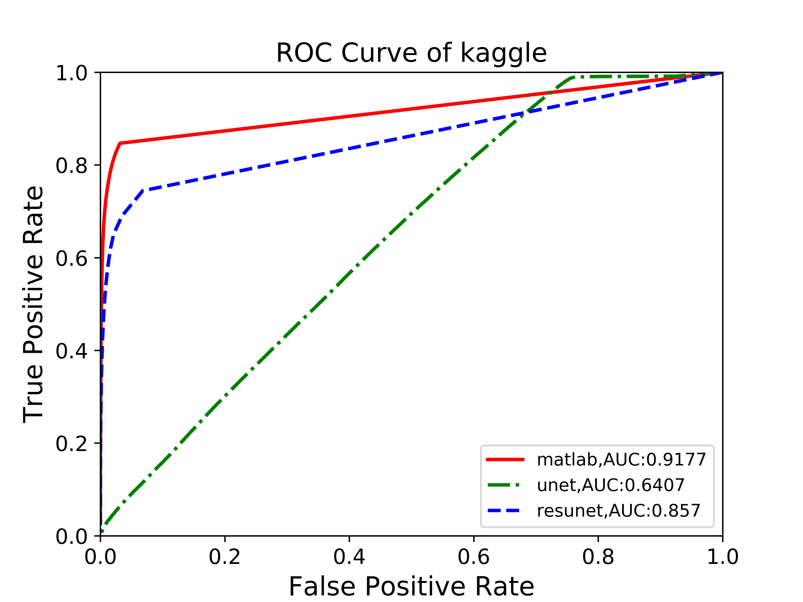

====
autometric
====

``autometric`` is to help draw ROC,PR curves for image semantic segmentation problem.When you have groundtruth image and
predict probabilistic image,this package can draw ROC,PR curves and save them to your savepath.It can also calculate FPR
(False Positive Rate) TPR(True Positive Rate) AUC(Area under Curve) MAP(Mean Average Precision) IoU(Intersection over Union)
at the same time.

Usage
-----

``autometric`` include the following function/class:

- ``CollectData``: a ``class`` to calculate FPR,TPR,AUC,MAP,IOU

- ``DrawCurve``: a ``class``  to draw and save ROC PR curves

- ``fileList``: a ``function`` to collect file to a list

- ``drawCurve``: a ``function`` to draw curves and calculate parameters.Read example.py to get an idea of how to use!

